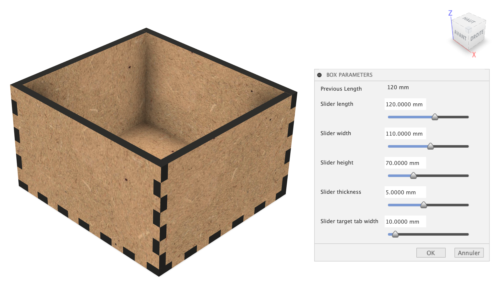

# Box parameters

An add-in for Autodesk Fusion 360 that provides custom parameters dialog dedicated to the parametric box by Pierre Rossel.

## Features

<!-- image box_parameters_demo.png -->

- Slider bars to intuitively adjust the parameters (click, drag or scroll)

## Installation

1. Download the source code from the latest release and extract the archive
2. To permanently install the add-in copy the source code to `C:\Users\%Username%\AppData\Roaming\Autodesk\Autodesk Fusion 360\API\AddIns`
or 
~/Library/Application Support/Autodesk/Autodesk Fusion 360/API/AddIns/Box parameters

3. OR to open it from its existing location go to **UTILITIES** toolbar tab > **ADD-INS** > **Add-Ins** tab > Green **+** button and locate the INNER directory containing the source code

## Running

1. Go to **UTILITIES** toolbar tab > **ADD-INS** > **Add-Ins** tab
2. Click **Box Parameters** in the list to highlight
3. Select **Run on Startup** (Optional)
4. Click **Run**
5. Click on the icon in the plugins panel
6. A window will load

## Using the Add-in

- Drag a slider left/right, use a mouse scroll wheel or click left/right of the slider to change the value
- Click OK to keep the changes or Cancel to revert to previous values

## Limitations

- Current version only works with specific parameter names. It can be used with any file that has at least these parameters names confirgured in mm:
  - xSize
  - ySize
  - zSize
  - thickness
  - targetTabWidth
- Sliders limits are hard coded
